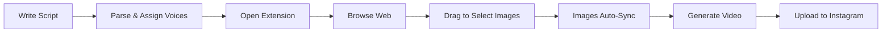

# 🎬 BrainRot Generator

> **Transform dialogue scripts into viral short-form videos with AI voices and web-scraped images**

[](https://github.com/ayushganvir/brainrot-generator)
[](https://www.python.org/)
[](LICENSE)

Create engaging dialogue videos like the viral "Peter & Stewie" format - automatically! Features AI voice generation, a Chrome extension for grabbing images from anywhere on the web, and direct Instagram upload.

---

## 🌟 Key Features

### 🎙️ **AI-Powered Voice Generation**
- **Multi-speaker support** with ElevenLabs AI voices
- **Character voices** (Peter Griffin, Stewie, or any custom voice)
- **Natural timing** with automated dialogue pacing
- **Preview audio** before generating the full video

### 🖼️ **Chrome Extension - The Game Changer**
- **Drag-to-select** any area on ANY webpage to capture images
- **Real-time sync** between extension and web app
- **Side panel UI** stays visible while browsing
- **Per-dialogue images** - associate specific images with each line
- **Works everywhere** - respects CORS, handles all DPIs

### 🎥 **Professional Video Output**
- **1080x1920 vertical format** (perfect for Reels/TikTok/Shorts)
- **Animated captions** with speaker avatars
- **Custom backgrounds** or use built-in defaults
- **Auto-loop** short videos to match dialogue length
- **Professional styling** with shadows and smooth animations

### 📱 **Instagram Integration**
- **Direct upload** to Instagram Reels or Feed
- **Multiple accounts** management
- **Upload history** tracking
- **Public URL** support via ngrok

---

## 🚀 Quick Start

### Prerequisites

```bash
# Python 3.8 or higher
python --version

# Install dependencies
pip install -r requirements.txt
```

### API Keys Required

Create a `.env` file:
```env
OPENAI_API_KEY=your_openai_key_here
ELEVENLABS_API_KEY=your_elevenlabs_key_here
PUBLIC_URL=https://your-ngrok-url.ngrok-free.app  # Optional, for Instagram
```

### Installation

```bash
# 1. Clone the repository
git clone https://github.com/ayushganvir/brainrot-generator.git
cd brainrot-generator

# 2. Install Python dependencies
pip install -r requirements.txt

# 3. Set up environment variables
cp .env.example .env
# Edit .env with your API keys

# 4. Run the application
python app.py

# 5. Open in browser
# Visit http://localhost:8000
```

### Chrome Extension Setup

1. Open Chrome and go to `chrome://extensions/`
2. Enable **Developer mode** (top right)
3. Click **Load unpacked**
4. Select the `chrome-extension` folder
5. Pin the extension to your toolbar

---

## 🎯 How to Use

### Step 1: Write Your Script
```
Peter: Y'know, this AI stuff is pretty amazing!
Stewie: Indeed, quite a remarkable technological advancement.
Peter: I can make videos without even trying!
Stewie: Precisely. The future is now, you buffoon.
```

### Step 2: Parse & Assign Voices
1. Paste your script in the web app
2. Click **"Parse Script & Load Voices"**
3. Assign ElevenLabs voices to each speaker
4. Upload speaker avatars (optional)
5. Preview the audio

### Step 3: Add Images (The Cool Part!)
**Option A: Upload manually**
- Click the upload button for each dialogue line

**Option B: Use the Chrome Extension** ⭐
1. Click the extension icon in Chrome
2. Navigate to ANY website (Google Images, Reddit, Twitter, etc.)
3. For each dialogue, click **"Select Image"**
4. **Drag to select** the area you want to capture
5. Images automatically sync to the web app!

### Step 4: Generate Video
1. Upload a background video (or use defaults)
2. Enable auto-loop if needed
3. Click **"Generate Video"**
4. Download or upload directly to Instagram!

---

## 🛠️ Tech Stack

| Component | Technology |
|-----------|-----------|
| **Backend** | FastAPI, Python |
| **AI Voices** | ElevenLabs TTS API |
| **Video Processing** | MoviePy, FFmpeg |
| **Frontend** | Vanilla HTML/CSS/JavaScript |
| **Extension** | Chrome Extension Manifest V3 |
| **Social Media** | Instagram Graph API |
| **Deployment** | Uvicorn, ngrok (for Instagram) |

---

## 📂 Project Structure

```
brainrot-generator/
├── app.py                      # Main FastAPI application
├── script_parser.py            # Dialogue parsing & speaker detection
├── instagram_manager.py        # Instagram API integration
├── requirements.txt            # Python dependencies
├── .env                        # Environment variables (create this)
│
├── static/                     # Web interface
│   ├── index.html             # Landing page
│   ├── script_mode.html       # Main app interface
│   └── instagram.html         # Instagram manager
│
├── chrome-extension/           # Chrome extension
│   ├── manifest.json          # Extension config
│   ├── sidepanel.html         # Side panel UI
│   ├── sidepanel.js           # Extension logic
│   ├── background.js          # Service worker
│   ├── content.js             # Page interaction
│   └── *.png                  # Extension icons
│
├── outputs/                    # Generated videos
├── uploads/                    # User uploads
├── default_videos/             # Default backgrounds
└── mediachain/                 # Video processing engine
```

---

## 🎨 Chrome Extension Deep Dive

### Why It's Awesome
Instead of manually downloading images, right-clicking, saving, uploading... you can:
1. Browse to any website
2. Drag a box over what you want
3. Done! Image is captured and synced

### Technical Features
- **Accurate area selection** - works on all screen DPIs (1x, 2x, 3x)
- **Transparent selection box** - no blue tint in captures
- **Viewport-aware** - handles scrolling and zoom correctly
- **Real-time sync** - polls every 2 seconds for updates
- **Session persistence** - remembers your session across browser restarts

### How It Works
1. **Content Script** injects UI for area selection
2. **Background Worker** captures screenshot via Chrome API
3. **Coordinate Scaling** handles device pixel ratio automatically
4. **Image Cropping** extracts exact selected area
5. **API Upload** sends to Flask backend
6. **Real-time Polling** updates both UIs instantly

---

## 📸 Example Workflow



---

## 🔧 Configuration

### Video Settings
```python
RESOLUTION = (1080, 1920)  # Vertical format
FPS = 30
AUDIO_SAMPLE_RATE = 44100
VIDEO_CODEC = 'libx264'
AUDIO_CODEC = 'aac'
```

### Caption Styling
```python
FONT = 'Arial-Bold'
FONT_SIZE = 60
COLOR = 'white'
STROKE_COLOR = 'black'
STROKE_WIDTH = 3
POSITION = ('center', 'bottom')  # Bottom third
```

### Instagram Upload
- Requires `PUBLIC_URL` in `.env` (use ngrok)
- Video must be publicly accessible
- Supports both Reels and Feed posts
- Auto-cleanup after successful upload

---

## 🐛 Troubleshooting

<details>
<summary><b>Extension shows "No session found"</b></summary>

**Solution:**
1. Make sure you've parsed a script in the web app first
2. Refresh the extension side panel
3. Check that Flask is running on `http://localhost:8000`
4. Open browser console and check for errors
</details>

<details>
<summary><b>Images not syncing between extension and app</b></summary>

**Solution:**
1. Check browser console for CORS errors
2. Verify Flask API is responding: `http://localhost:8000/api/extension/session/[session_id]`
3. Ensure both extension and app are polling (every 2s)
4. Try reloading the extension
</details>

<details>
<summary><b>Area selection captures wrong region</b></summary>

**Solution:**
1. Reload the extension after any updates
2. Check device pixel ratio in console logs
3. Ensure browser zoom is at 100%
4. Try on a different webpage
</details>

<details>
<summary><b>Instagram upload fails</b></summary>

**Solution:**
1. Set `PUBLIC_URL` in `.env` (must use ngrok or similar)
2. Verify Instagram access token is valid
3. Check video is publicly accessible at the URL
4. Ensure video meets Instagram requirements (duration, size, format)
</details>

---

## 🎓 Advanced Usage

### Custom Voice Models
```python
# Add your own ElevenLabs voice IDs
CUSTOM_VOICES = {
    "MyCharacter": "voice_id_here"
}
```

### Batch Processing
```bash
# Process multiple scripts
python batch_process.py scripts/*.txt
```

### API Integration
```python
import requests

response = requests.post('http://localhost:8000/api/generate-video-script', 
    files={'video': open('background.mp4', 'rb')},
    data={'script': 'Peter: Hello!\nStewie: Greetings!'}
)
```

---

## 🤝 Contributing

Contributions are welcome! Here's how:

1. **Fork** the repository
2. **Create** a feature branch (`git checkout -b feature/AmazingFeature`)
3. **Commit** your changes (`git commit -m 'Add some AmazingFeature'`)
4. **Push** to the branch (`git push origin feature/AmazingFeature`)
5. **Open** a Pull Request

### Ideas for Contributions
- [ ] Add more default voices
- [ ] Support for other video formats
- [ ] TikTok direct upload
- [ ] Batch video generation
- [ ] Video templates
- [ ] Mobile app version

---

## 📄 License

This project is licensed under the MIT License - see the [LICENSE](LICENSE) file for details.

---

## 🙏 Acknowledgments

- **[ElevenLabs](https://elevenlabs.io/)** - Amazing AI voice generation
- **[OpenAI](https://openai.com/)** - GPT for script assistance
- **[MoviePy](https://zulko.github.io/moviepy/)** - Powerful video editing
- **[FastAPI](https://fastapi.tiangolo.com/)** - Modern web framework
- **Chrome Extension APIs** - Making web scraping easy

---

## 📞 Support

- 🐛 **Bug reports**: [Open an issue](https://github.com/ayushganvir/brainrot-generator/issues)
- 💡 **Feature requests**: [Start a discussion](https://github.com/ayushganvir/brainrot-generator/discussions)
- 📧 **Contact**: [Your email or social media]

---

## ⭐ Show Your Support

If you found this project useful, please consider:
- ⭐ **Starring** the repository
- 🐦 **Sharing** on social media
- 🍕 **Buying me a coffee** (if you add donation link)

---

<div align="center">

**Made with ❤️ for creating viral content**

[⬆ Back to Top](#-brainrot-generator)

</div>


---

## ✨ Features

### 🎙️ **AI Voice Generation**
- Multi-speaker dialogue support with ElevenLabs voices
- Character-specific voice assignment (Peter Griffin, Stewie, custom voices)
- Natural conversation flow with automated timing

### 🎥 **Video Creation**
- Custom background videos or random defaults
- Auto-loop short backgrounds to match dialogue length
- Animated captions with speaker avatars
- Professional styling with shadows and positioning
- Export-ready MP4 output (1080x1920 vertical format)

### 🖼️ **Chrome Extension - Image Selection**
- **Drag-to-select** area capture from any webpage
- Real-time sync between extension and web app
- Side panel UI for easy image management
- Dialogue-specific image association
- Works on all websites (respects CORS)

### 📝 **Script Parsing**
- Automatic speaker detection
- Dialogue breakdown and preview
- Optional image upload per dialogue line
- Voice preview before generation

### 📱 **Instagram Integration**
- Direct upload to Instagram (Reels/Feed)
- Multiple account management
- Upload history tracking
- Public URL support via ngrok

---

## 🚀 Quick Start

### Prerequisites
```bash
# Python 3.8+
pip install -r requirements.txt

# API Keys (add to .env)
OPENAI_API_KEY=your_key
ELEVENLABS_API_KEY=your_key
PUBLIC_URL=https://your-ngrok-url.ngrok-free.app  # for Instagram
```

### Installation

1. **Clone the repository**
```bash
git clone <your-repo-url>
cd content_gen
```

2. **Install dependencies**
```bash
pip install -r requirements.txt
```

3. **Set up environment variables**
```bash
cp .env.example .env
# Edit .env with your API keys
```

4. **Install Chrome Extension**
- Open Chrome: `chrome://extensions/`
- Enable "Developer mode"
- Click "Load unpacked"
- Select `chrome-extension` folder

5. **Run the app**
```bash
python app.py
# Visit http://localhost:8000
```

---

## 🎯 How It Works

### 1. **Write Your Script**
```
Peter: Y'know, this AI stuff is pretty cool!
Stewie: Indeed, quite remarkable technology.
```

### 2. **Select Images (Optional)**
- Click extension icon in Chrome
- Navigate to any webpage
- Drag to select areas for each dialogue
- Images sync automatically to the app

### 3. **Assign Voices**
- Choose ElevenLabs voices for each speaker
- Preview audio before generating
- Upload custom speaker avatars (optional)

### 4. **Generate Video**
- Upload background video or use defaults
- Click "Generate Video"
- Download or upload directly to Instagram

---

## 🛠️ Tech Stack

- **Backend**: FastAPI, Python
- **AI**: OpenAI GPT, ElevenLabs TTS
- **Video**: MoviePy, FFmpeg
- **Frontend**: Vanilla HTML/CSS/JS
- **Extension**: Chrome Extension Manifest V3
- **APIs**: Instagram Graph API

---

## 📂 Project Structure

```
content_gen/
├── app.py                 # Main FastAPI application
├── script_parser.py       # Dialogue parsing logic
├── instagram_manager.py   # Instagram API integration
├── static/
│   ├── index.html        # Landing page
│   └── script_mode.html  # Main app interface
├── chrome-extension/      # Chrome extension
│   ├── manifest.json
│   ├── sidepanel.html
│   ├── sidepanel.js
│   └── background.js
├── outputs/              # Generated videos
├── default_videos/       # Default backgrounds
└── uploads/              # User uploads
```

---

## 🎨 Chrome Extension Features

### Area Selection
- **Drag-to-select** any screen region
- Transparent selection box (no blue tint)
- Accurate coordinate mapping (works on all DPIs)
- Minimum 50x50px selection

### Side Panel UI
- Persistent while browsing
- Real-time image preview
- Dialogue-to-image mapping
- Remove/change images easily

### Session Management
- Auto-syncs with Flask app
- Stores session in Chrome storage
- Polls for updates every 2 seconds
- Works across browser restarts

---

## 🔧 Configuration

### Video Settings
- **Resolution**: 1080x1920 (vertical)
- **Frame Rate**: 30 FPS
- **Audio**: 44.1kHz stereo
- **Format**: MP4 (H.264)

### Caption Styling
- Font: Arial Bold
- Size: 60px
- Color: White with black outline
- Position: Bottom third
- Shadow: 3px offset

### Instagram Upload
- Requires `PUBLIC_URL` environment variable
- Uses Instagram Graph API
- Supports video containers and publishing
- Auto-cleanup after upload (optional)

---

## 📸 Screenshots

### Main Interface


### Chrome Extension


### Generated Video


---

## 🐛 Troubleshooting

**Extension shows "No session found":**
- Parse script in Flask app first
- Refresh extension side panel
- Check Flask is running on localhost:8000

**Images not syncing:**
- Check browser console for errors
- Verify Flask API is responding
- Ensure both are polling (every 2s)

**Instagram upload fails:**
- Set `PUBLIC_URL` in .env (use ngrok)
- Check access token is valid
- Ensure video is publicly accessible

**Area selection captures wrong area:**
- Reload extension after updates
- Check device pixel ratio in console
- Ensure viewport is not zoomed

---

## 🤝 Contributing

Contributions welcome! Please:
1. Fork the repository
2. Create a feature branch
3. Make your changes
4. Submit a pull request

---

## 📄 License

MIT License - feel free to use for personal or commercial projects!

---

## 🙏 Acknowledgments

- **ElevenLabs** - AI voice generation
- **OpenAI** - Script parsing assistance
- **MoviePy** - Video processing
- **Instagram Graph API** - Social media integration

---

## 📞 Contact

Questions? Issues? Feature requests?
- Open an issue on GitHub
- Or reach out via [your contact method]

---

**⭐ Star this repo if you found it useful!**

Made with ❤️ for creating viral content
